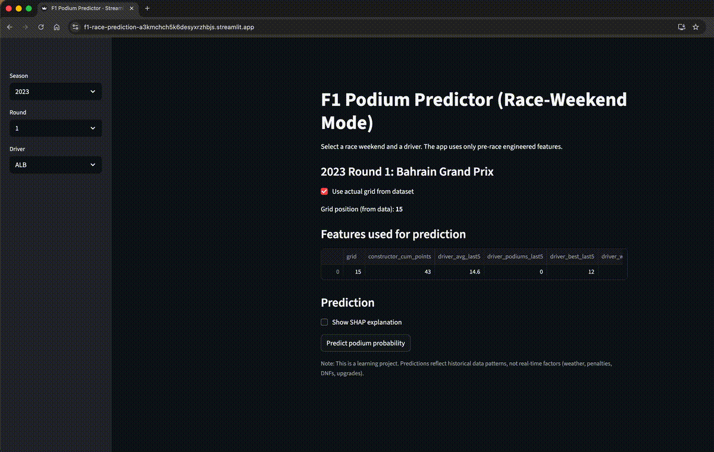

# F1 Podium Predictor (2021–2023) — Race-Weekend App + SHAP Explanations

End-to-end machine learning project that predicts the probability of an F1 driver finishing on the **podium (Top 3)** for a selected **race weekend**. Includes a **Streamlit app** and **SHAP-based local explanations** so you can see *why* the model made a prediction.

## Live App
## Demo



Try the model live on Streamlit Community Cloud:

👉 **https://f1-race-prediction-a3kmchch5k6desyxrzhbjs.streamlit.app/**

Use the sidebar to select:

- **Season**
- **Round**
- **Driver**
- (Optional) grid position for “what-if” scenarios

Then click **Predict podium probability** to see the model output and SHAP explanations.

## What this project does

- Pulls historical Formula 1 race results (2021–2023) using an Ergast-compatible API
- Builds **pre-race features** with strict leakage controls (no post-race data used for prediction)
- Trains a **RandomForestClassifier** in an sklearn `Pipeline` (imputation + one-hot encoding)
- Provides a **Streamlit “Race-Weekend Mode”** UI:
  - Select season + round + driver
  - Uses actual grid (or lets you override grid for what-if analysis)
  - Predicts podium probability
  - Shows SHAP factors that pushed the prediction up/down

## Key ML Concepts Demonstrated

- **Data ingestion + pagination handling**
- **Feature engineering** (rolling “last 5” driver form, constructor points-to-date)
- **Leakage detection & remediation**
- **Temporal validation** (train on past seasons, test on future season)
- **Model deployment** (local Streamlit app)
- **Explainability** (SHAP local explanations)

---

## Data & Feature Engineering (Leakage-Safe)

The model is trained only on information that is available **before race start**.

### Target
- `podium`: `1` if finishing position ≤ 3, else `0`

### Predictive Features (used in the model)
Numeric:
- `grid`
- `constructor_cum_points` (cumulative constructor points **shifted** so it excludes current race)
- `driver_avg_last5` (rolling mean finishing position, shifted)
- `driver_podiums_last5` (rolling podium count, shifted)
- `driver_best_last5` (rolling min position, shifted)
- `driver_worst_last5` (rolling max position, shifted)
- `grid_delta_vs_teammate` (grid difference vs teammate for that race)

Categorical (one-hot encoded):
- `Driver.code`
- `Constructor.name`

### Leakage Controls
These post-race columns are **never** used as model inputs:
- `position`, `points`, `Time.*`, `FastestLap.*`, `laps`, etc.

---

## Repository Structure

```text
f1-predictor/
├─ app/
│  └─ streamlit_app.py
├─ data/
│  ├─ f1_multi_season_raw.csv                # raw pulled data (optional to commit)
│  └─ f1_multi_season_engineered.csv         # engineered features
├─ model/
│  └─ f1_podium_predictor_multi_season.pkl   # trained sklearn pipeline
├─ notebooks/                                 # data + modeling notebooks
├─ requirements.txt
├─ .gitignore
└─ README.md